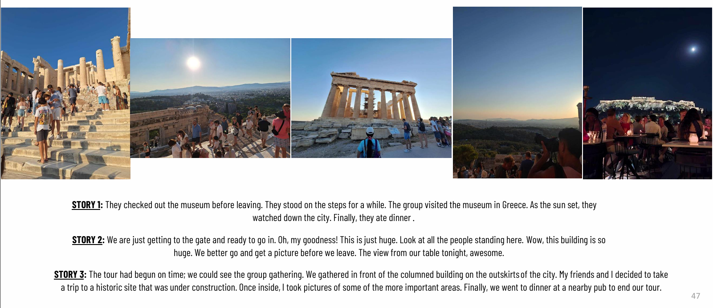
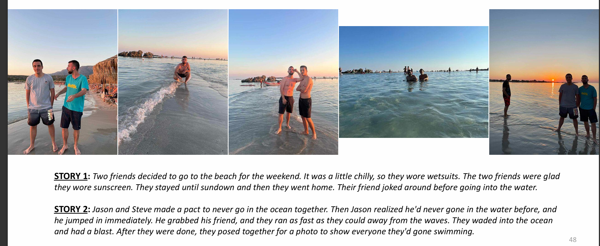

# A brief Summary of the Visual-Storyteller:

#### The model deployed in this project is a chained framework that creates stories for a series of images (task commonly known as Visual Storytelling). In order to do so, this task is dealt as a two-step problem, where first a captioner model creates descriptions for capturing the existential information in the sequence of images and a storyteller uses and reformulates these captions to a semantically enriched and coherent story. If you are really interested in this project, please refer to the presenation and/or the final report under the folder [FINAL_PRODUCT](./FINAL_PRODUCT).


# How to Use:

If you want to explore the code files and, in general, the whole project you can clone the repository, by executing: 
```bash 
git clone https://github.com/arpajj/Visual-Storyteller.git
```

However, its _highly recommended_ ✅ that you use the framework only on inference time (eg. generating a story for you), since for training the model(s) a lot of resources are required (GPU and storage memory for the VIST dataset). To that, if you are only interested in testing the framework, most of the directories will not be useful (especially the code-flies in [code_new](./code_new)).

#### To that end, for using the pipeline for Inference time you can follow the steps below : 

__Step 1__: Download and install all the required packages from [the requirements file](./requirements.txt) by using: `pip install -r requirements.txt`.

__Step 2__: Download the framework's weights from the given link 🔗 [HERE](https://drive.google.com/drive/folders/1PJ65Y_VKar-HQDIHFr4aePVQWU8twZsL?usp=drive_link) (size: ~2GB). 
Preferably, store them under the same directory.

__Step 3__: Download the files [helper.py](./Evaluation/helper.py) and [evaluate.py](./Evaluation/evaluate.py) from the folder [Evaluation](./Evaluation) and store them locally under the same directory. 

Alternatively, use the following commands to download them directly:

```bash
# Download helper.py
wget https://raw.githubusercontent.com/arpajj/Visual-Storyteller/main/Evaluation/helper.py
# or
curl -O https://raw.githubusercontent.com/arpajj/Visual-Storyteller/main/Evaluation/helper.py

# Download evaluate.py
wget https://raw.githubusercontent.com/arpajj/Visual-Storyteller/main/Evaluation/evaluate.py
# or
curl -O https://raw.githubusercontent.com/arpajj/Visual-Storyteller/main/Evaluation/evaluate.py
```

__Step 4__: Create a folder locally with five images of your choice or pull one of the sub-folders present under the folder [Visual Stories](https://github.com/arpajj/Visual-Storyteller/tree/main/Visual%20Stories). To pull one of the sub-folders from the present repository follow the steps below, for partially cloning only a selected sub-folder:

```bash
git clone --depth 1 --filter=blob:none --sparse https://github.com/arpajj/Visual-Storyteller.git
cd Visual-Storyteller
git sparse-checkout set "Visual Stories/Visual Story X"
```

In the third command 'X' is the number of the subfolder you want to download. Check inside the [Visual Stories](https://github.com/arpajj/Visual-Storyteller/tree/main/Visual%20Stories) folder: there are 18 different options.

__Step 5__: Make the necessary adjustments (regarding the models/images paths) on the file [evaluate.py](./Evaluation/evaluate.py) and run the file by executing: `python evaluate.py`.


# Results: 

#### Some examples of generated stories are presented below: 






